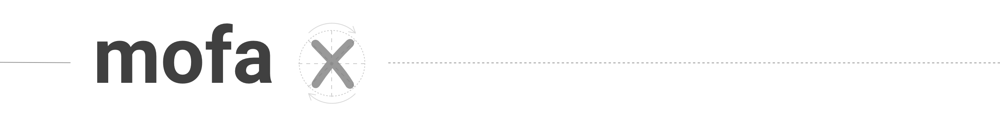

Explore MOFA+ models with [mofax](https://github.com/gtca/mofax) in your browser. Powered by [Dash](https://plot.ly/dash/) from plotly.

See [more on MOFA+ here](https://github.com/biofam/MOFA2/). See [more on Dash apps here](https://dash.plot.ly/).

## Getting started

### Installation

```
pip install git+https://github.com/gtca/mofax
```

### Launching

Provide a trained MOFA+ model when calling `mofax` to open it in a web dashboard:

```
mofax mofa_model.hdf5
```
